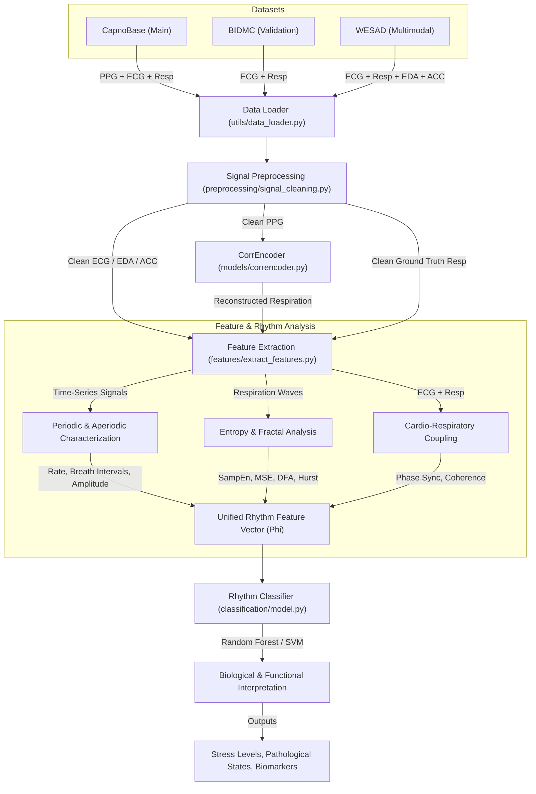

# Multimodal Biological Rhythm Analysis System
## Deep Learning Respiration Waveform Extraction from PPG

This repository implements the first phase of the **Multimodal Biological Rhythm Analysis System**, focused on extracting continuous respiration waveforms directly from optical Photoplethysmography (PPG) signals using deep learning. This project serves as a Deep Learning Mini Project & M.Tech Dissertation Phase-I.

---

## 👨‍🎓 Author Credentials
*   **Author**: **Rehan I. Mokashi**
*   **Position**: First Year M.Tech Student
*   **Affiliation**: [Government College of Engineering, Karad](http://www.gcekarad.ac.in/)
*   **AI Partner**: Antigravity AI (Google DeepMind Team)

---

## 📊 System Architecture & Data Flow
GitHub will render the following architecture diagram natively:



---

## 🚀 Key Project Achievements (Phase 1)
*   **Deep Bottleneck 1D CNN Autoencoder**: Features a 3-layer convolutional autoencoder (large kernel sizes 31, 15, and 7) designed to track slow-frequency respiratory rhythm (4–6 seconds cycles) while completely ignoring high-frequency heartbeat noise.
*   **Robust Signal Preprocessing**: Includes robust NaN-handling, z-score normalization, and Second-Order Sections (SOS) bandpass filtering to prevent signal instability.
*   **Automated PowerPoint Progress Report**: Integrated presentation generator to build standard M.Tech progress slides automatically.
*   **Clinical Benchmark Validation**: Trained and tested on CapnoBase clinical datasets.

---

## 📂 Repository Structure
```text
├── models/
│   ├── correncoder.py              # PyTorch Deep Bottleneck 1D CNN architecture
│   └── resp_model.pth              # Saved model weights (3KB)
├── preprocessing/
│   └── signal_cleaning.py          # SOS Bandpass filter & Z-score normalization
├── utils/
│   ├── data_loader.py              # CapnoBase HDF5 MAT file loader
│   ├── trainer.py                  # PyTorch train script harness
│   └── visualization.py            # Overlay comparison plotting tool
├── main.py                         # Diagnostic testing runner
├── train_model.py                  # Main model training script
├── check_data.py                   # Data diagnostic validator
├── generate_ppt.py                 # PowerPoint slide generator
├── Figure_1.png                    # Model output waveform plot
├── Project_Progress_Presentation.pptx # Generated slide presentation
└── .gitignore                      # Git exclusion rules (Large datasets ignored)
```

---

## 🛠️ Installation & Setup
1. Clone the repository:
   ```bash
   git clone https://github.com/<your-username>/<repo-name>.git
   cd <repo-name>
   ```
2. Install dependencies:
   ```bash
   pip install torch numpy scipy matplotlib python-pptx h5py
   ```
3. *Note on Datasets*: Large MATLAB `.mat` files are excluded from this repository via `.gitignore` to meet GitHub upload limits. Ensure clinical CapnoBase subject files are placed inside `data/capnobase/` locally.

---

## 🏃 How to Run
*   **Verify Data Loading**:
    ```bash
    python check_data.py
    ```
*   **Train the Autoencoder**:
    ```bash
    python train_model.py
    ```
*   **Run Diagnostics & Plot Output**:
    ```bash
    python main.py
    ```
*   **Generate PowerPoint Progress Slides**:
    ```bash
    python generate_ppt.py
    ```

---

## 🏆 Debugging Milestones
1.  **Resolved NaN Loss Crashes**: Upgraded standard $(b,a)$ Butterworth filters to Second-Order Sections (`sos`) format to ensure absolute numerical stability.
2.  **Receptive Field Enlargement**: Expanded convolutional kernel sizes up to 31 and data windows to 3,000 samples (10 seconds) to extract macroscopic slow-breathing waves.
3.  **PPG Filtering Correction**: Fixed the "Invisible Breathing Bug" by adjusting the PPG filter lowcut from 0.5Hz to 0.1Hz, preserving the respiratory envelope.

---

## 📜 Future Roadmap
*   **Phase 2**: Add heart rate variability (HRV) and breath-to-breath interval (BBI) peak detectors.
*   **Phase 3**: Implement Sample Entropy (SampEn) complexity and Detrended Fluctuation Analysis (DFA) fractal scaling.
*   **Phase 4**: Add WESAD stress dataset to classify normal vs stress-induced breathing states.
*   **Phase 5**: Build nonlinear Van der Pol oscillator dynamical models.
